# DHCP, DNS, Static Routing – Cisco Packet Tracer Lab

## Opis projektu

Laboratorium przedstawia konfigurację podstawowych usług sieciowych w symulatorze Cisco Packet Tracer: **DHCP**, **DNS** oraz **trasowanie statyczne**. Projekt pozwala na praktyczne przećwiczenie konfiguracji serwerów, urządzeń końcowych i trasowania w środowisku symulowanym.

---

## Topologia sieci (zamierzony cel labu)

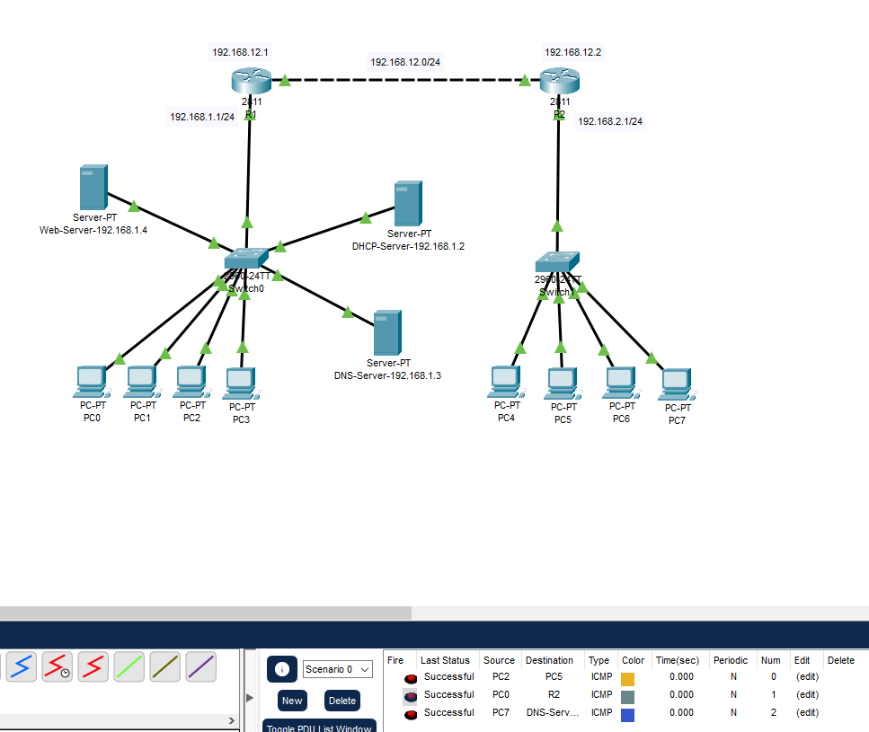

Sieć składa się z dwóch routerów, przełączników, serwera DHCP/DNS, serwera WWW oraz kilku stacji roboczych. Połączenia między urządzeniami zostały wykonane zgodnie z założeniami projektu.

---

## Konfiguracja DHCP

- **Serwer DHCP** został skonfigurowany z odpowiednimi pulami adresów IP dla poszczególnych segmentów sieci.
- Skonfigurowano `ip helper-address` na interfejsach routerów, aby umożliwić przekazywanie żądań DHCP do serwera.
  
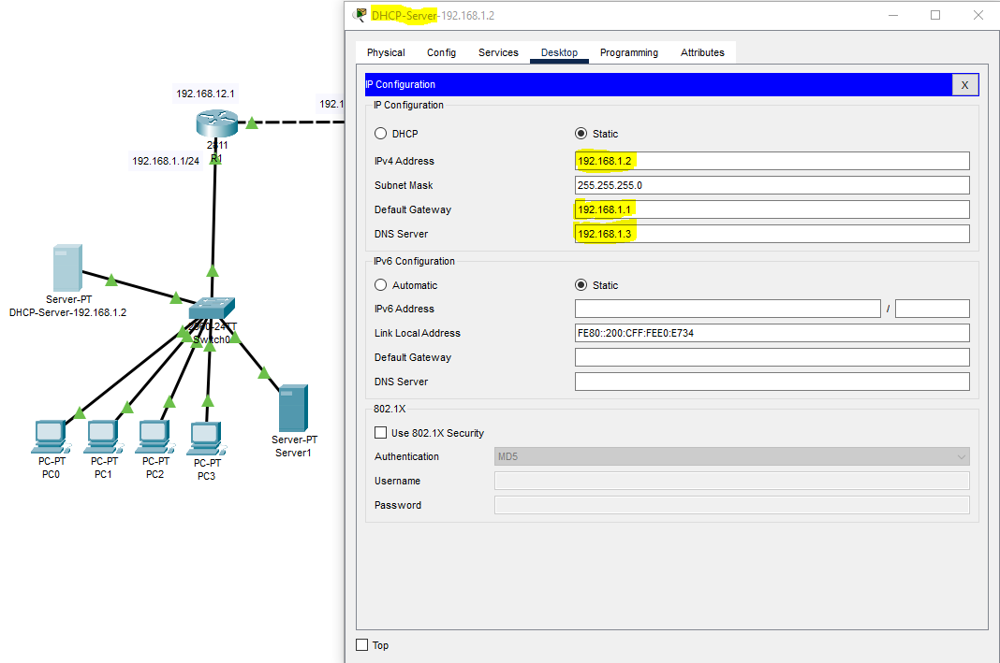
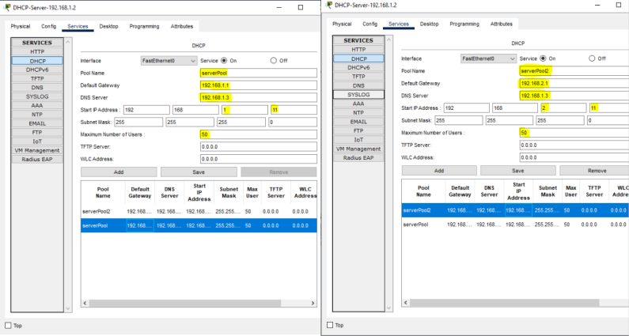
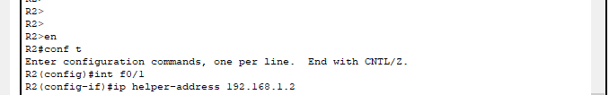

---

## Konfiguracja DNS

- **Serwer DNS** obsługuje rekordy domenowe dla lokalnej sieci.
- Rekordy DNS zostały przypisane do odpowiednich adresów IP serwera WWW.
- Pliki konfiguracyjne:
  
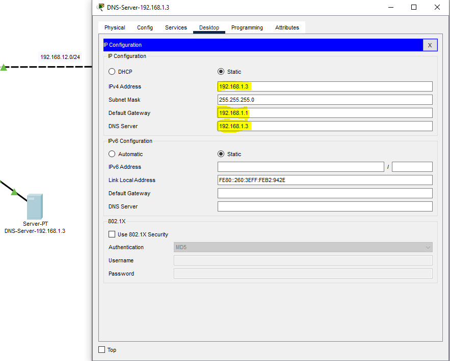
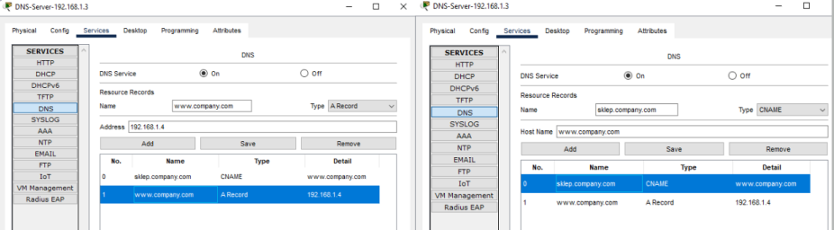

---

## Statyczne trasowanie

- Na routerach skonfigurowano trasy statyczne, aby zapewnić komunikację między wszystkimi segmentami sieci.
- Pliki konfiguracyjne:
  
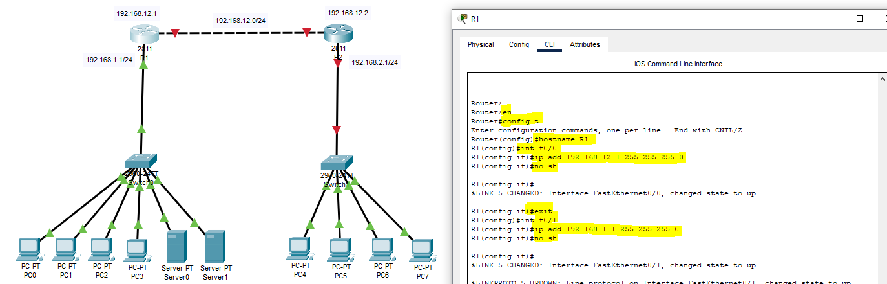
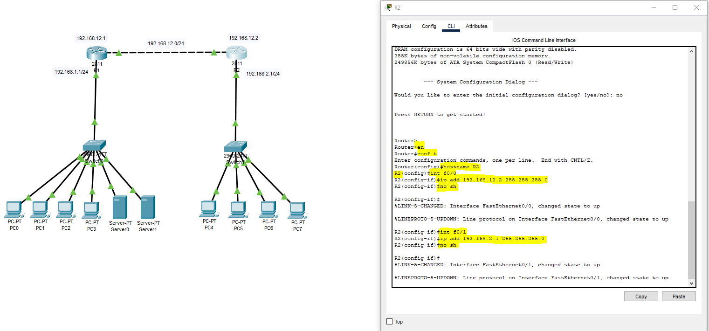
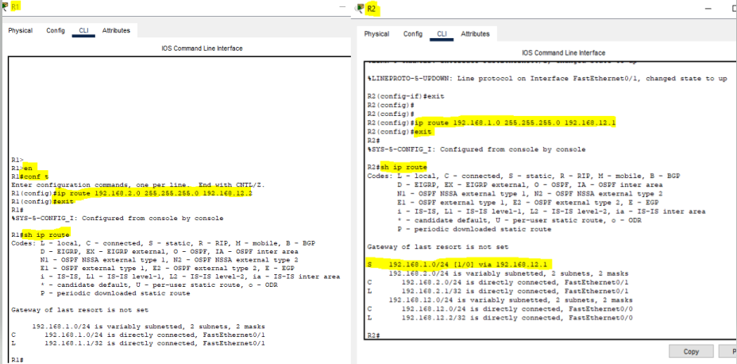

---

## Konfiguracja serwera WWW

- Sprawdzono poprawność przydzielania adresów IP przez DHCP na stacjach roboczych
- Przetestowano rozwiązywanie nazw przez DNS oraz dostępność serwera WWW

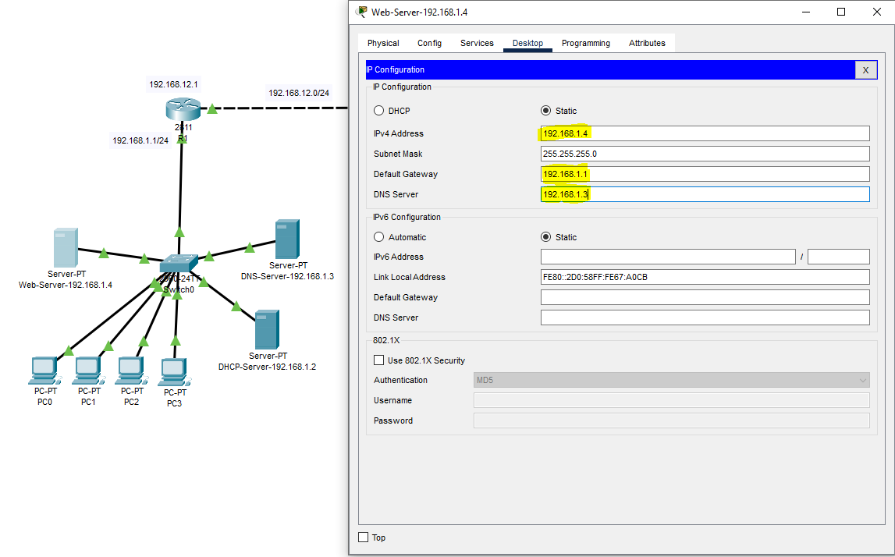
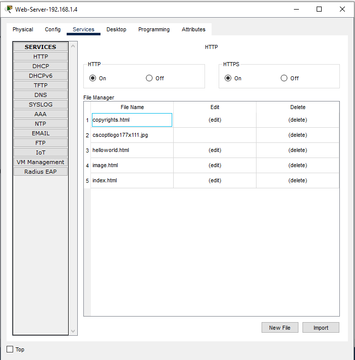
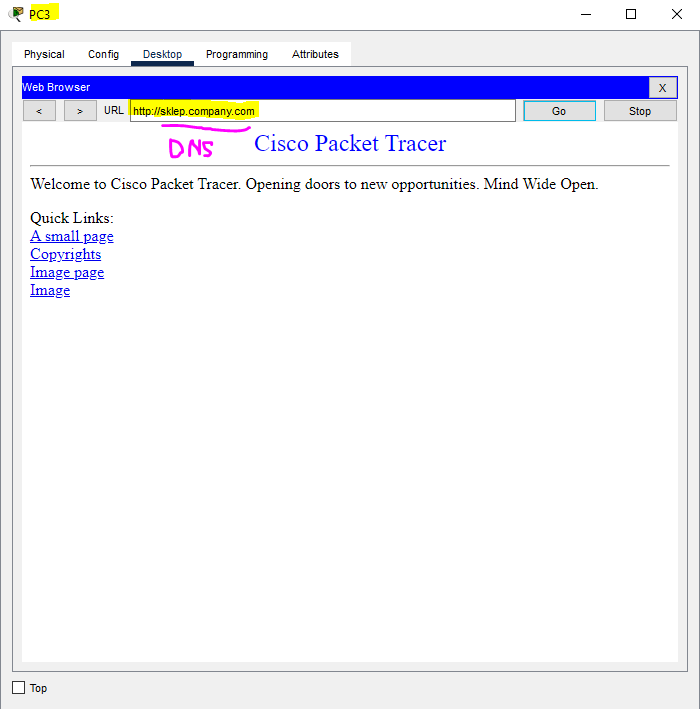

---

## Podsumowanie

Laboratorium pozwala zrozumieć i przećwiczyć podstawowe zagadnienia związane z konfiguracją usług DHCP, DNS oraz trasowania statycznego w środowisku Cisco Packet Tracer. Pliki konfiguracyjne oraz zrzuty ekranu pomagają krok po kroku przeprowadzić cały proces.
